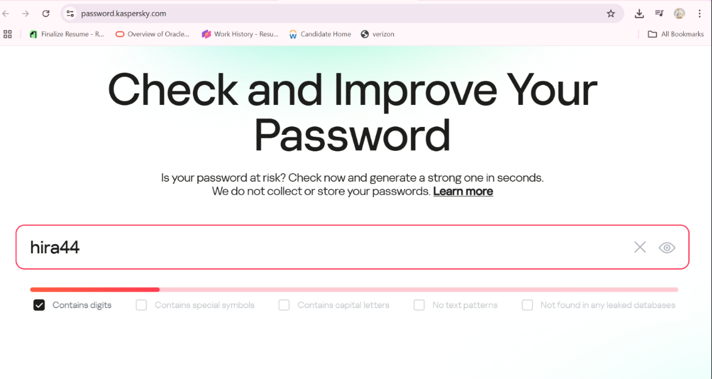
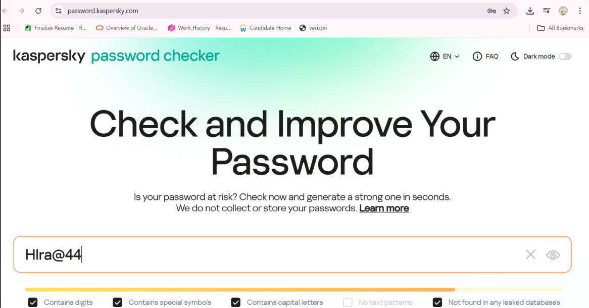
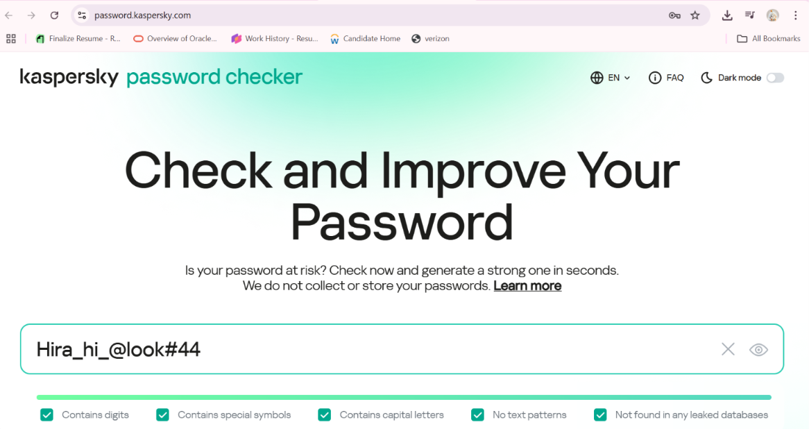

# 🔐 Password Strength Evaluation

## ✅ Objective

To understand the factors that make a password strong, evaluate different passwords using an online password strength checker, and summarize best practices for creating secure passwords.

---

## 🔍 Passwords Tested

| Password           | Strength    | Found in Leaks | Observations                                                  |
| ------------------ | ----------- | -------------: | ------------------------------------------------------------- |
| `hira`             | Very Weak ❌ |    2,137 times | Common name, short, all lowercase letters                     |
| `hira44`           | Weak ⚠️     |       11 times | Slightly stronger with digits, still short and predictable    |
| `Hlra@44`          | Medium ⚠️   |        2 times | Mixed case + symbol + digit, but too short                    |
| `Hira_hi_@look#44` | Strong ✅    |        0 times | Long, complex, strong character mix, not found in leaked data |

---

## 📸 Screenshots

### 1️⃣ Very Weak Password — `hira`


The password `hira` was found in leaked databases **2,137 times**. It is short, contains only lowercase letters, and provides extremely poor security.

---

### 2️⃣ Weak Password — `hira44`



The password `hira44` appeared in leaked databases **11 times**. Adding digits slightly improves the strength, but the password remains short and predictable.

---

### 3️⃣ Medium Password — `Hlra@44`



The password `Hlra@44` was found in leaked databases **2 times**. It contains uppercase letters, symbols, and digits, which improve its strength. However, its short length keeps it at a medium security level.

---

### 4️⃣ Strong Password — `Hira_hi_@look#44`



The password `Hira_hi_@look#44` was not found in the tested leaked databases. Its longer length and combination of uppercase and lowercase letters, numbers, and symbols make it considerably stronger.

---

## 🧠 Key Learnings

### 🔒 What Makes a Password Strong?

A strong password should:

* Have at least **12–16 characters**
* Include uppercase and lowercase letters
* Include numbers
* Include symbols such as `@`, `#`, and `!`
* Avoid personal information
* Avoid common dictionary words and predictable patterns
* Not appear in known leaked-password databases

---

## 🛡️ Common Password Attacks

| Attack Type           | Description                                                                        |
| --------------------- | ---------------------------------------------------------------------------------- |
| **Brute Force**       | Tries different combinations of characters until the password is discovered        |
| **Dictionary Attack** | Uses lists of common or previously leaked words and passwords to guess credentials |

---

## 🔐 Tools That Help Password Security

### Password Managers

Password managers can securely store and generate strong, unique passwords.

Examples include:

* Bitwarden
* LastPass

### Multi-Factor Authentication (MFA)

MFA provides an additional layer of account protection through methods such as:

* OTP codes
* Authentication applications
* Biometrics

---

## 💡 Password Best Practices

* Use long and unique passwords or passphrases
* Avoid using your name, birthday, or other easily guessed information
* Don't reuse the same password across multiple accounts
* Enable Multi-Factor Authentication whenever possible
* Use a password manager to generate and securely store passwords
* Regularly review passwords for signs of compromise

---

## 📁 Files Included

```text
Password-Strength-Evaluation/
│
├── README.md
├── very weak_Password.png
├── weak_Password.png
├── Medium_Password.png
└── Strong_Password.png
```

---

## 🔗 Tool Used

**Kaspersky Password Checker**

The project uses the Kaspersky Password Checker to evaluate password strength and check whether passwords have appeared in known data breaches.

---

## 📌 Project Overview

This project demonstrates how password length, complexity, character variety, and predictability affect password security.

By comparing passwords with different levels of complexity, the project highlights the importance of creating strong, unique passwords and following good password-security practices.
